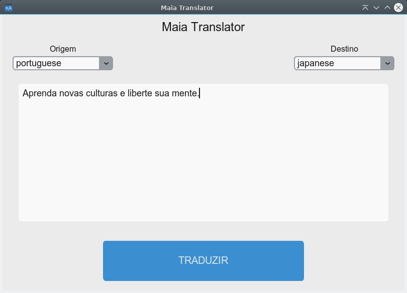
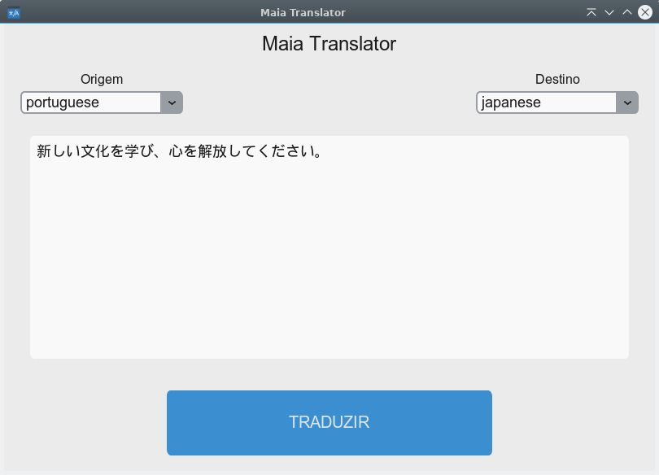

# Maia-Translator
<b> Tradutor feito em Python3 + Customtkinter + ApiGoogle

# Executar o projeto:
<b> Baixe o projeto, depois entre na sua pasta

<b> Crie o ambiente virtual para trabalhar com o python:

    python3 -m venv venv_linux

<b> Entre no ambiente virtual com o seguinte comando:

    source ./venv_linux/bin/activate

<b> Instale os requerimentos do arquivo requirements.txt:

    pip install -r requirements.txt

<b> Execute o programa com o seguinte comando:

    python main.py

# Imagem do programa

### Traduzindo texto

 

### Texto traduzido

# Tornar o programa um executável

<b> Depois de tudo instale o módulo pyinstaller:

    pip install pyinstaller

<b> Execute o arquivo  com o pyinstaller: 

    pyinstaller maia-translator.spec

<b> Depois disso criará duas pastas chamadas build e dist. Copie para dentro da pasta dist/ a pasta icones e a pasta settings.  Siga o comando abaixo:

    cp -rfv icones dist/

<b>
    
    cp -rfv settings dist/

<b> Depois forneça permissão ao executável que já está dentro da pasta dist

<b> Depois disto, entre dentro da pasta dist, e então, é só executar o programa dando duplo clique ou pelo terminal com o seguinte comando por exemplo:

    ./maia-translator
